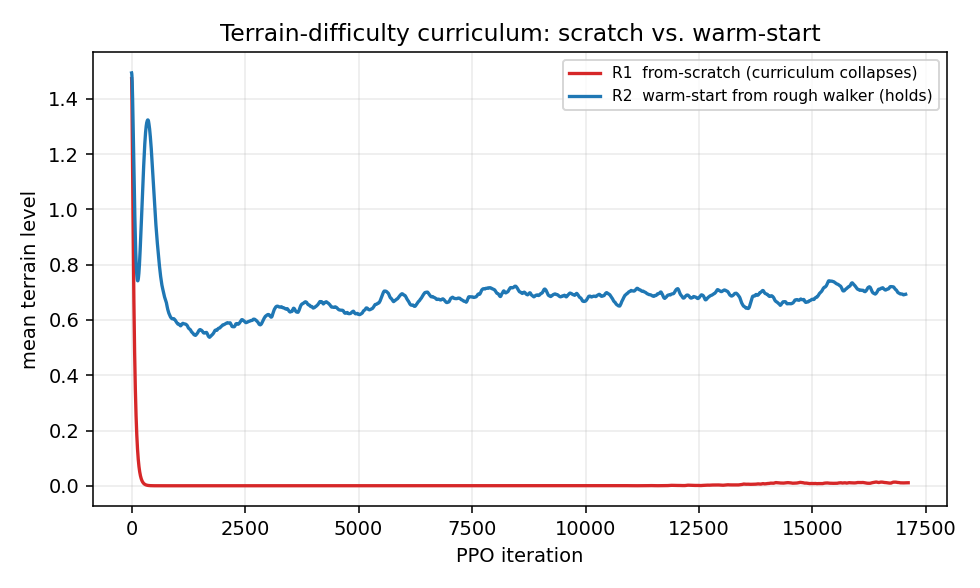
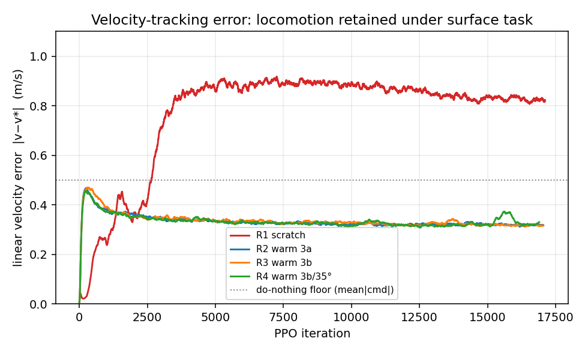
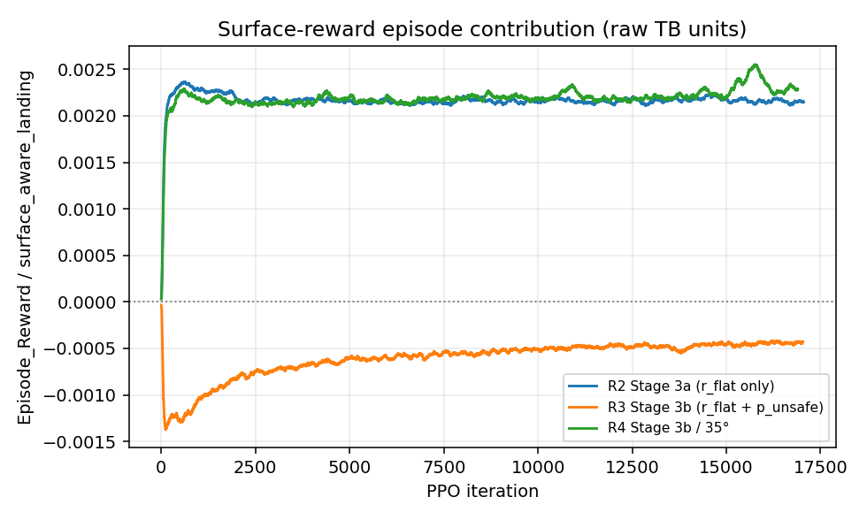
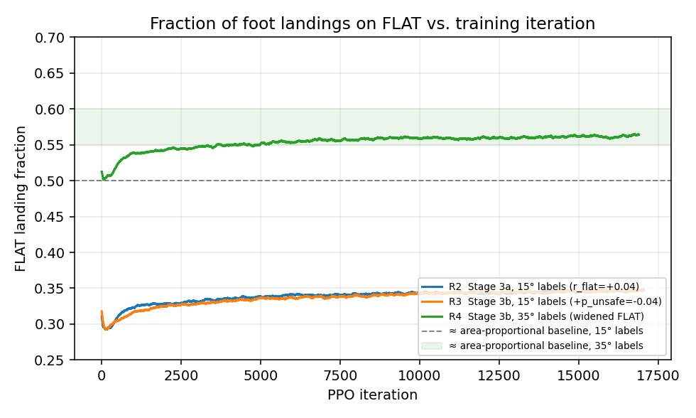
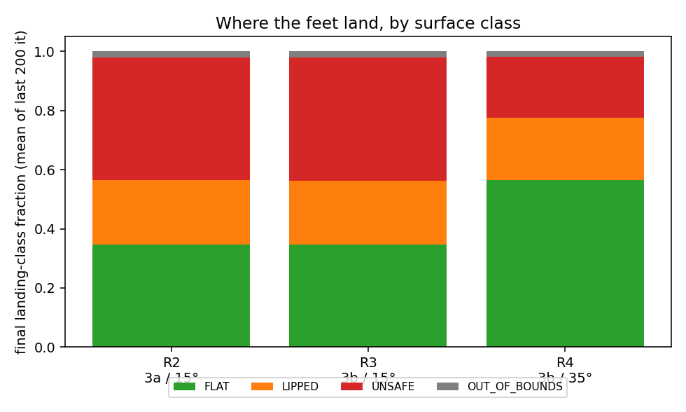

# RL-Based Foothold Selection for the Unitree Go2 on Conservation Terrain

**Chapters: Methodology · Experimental Setup · Results & Analysis**

> Draft note. Every quantitative value in this document is taken from a training
> log, configuration snapshot, or source file in the project tree; values that
> could not be recovered from a primary source are marked `[TODO: …]`. The
> headline result of the surface-aware stage is reported honestly as a **null
> finding** (per-footfall surface reward does not steer foot placement above an
> area-proportional baseline on this terrain), accompanied by the genuine
> positive outcomes — preserved locomotion under added perception and reward,
> and a set of methodological contributions. No result is overstated relative to
> the data.

---

# Chapter 1 — Methodology

## 1.1 Problem statement and research gap

The task is *foothold selection*: training a Unitree Go2 quadruped to place its
feet preferentially on safe, flat regions of uneven terrain rather than on
slopes, edges, or unstable features, while continuing to track a commanded base
velocity. The motivating application is locomotion on **conservation terrain** —
ecological restoration sites, vegetated ground, and uneven natural surfaces where
a legged platform must choose where to step to remain stable and to avoid
fragile or hazardous footings. To make the problem controllable and to obtain
reproducible per-pixel ground truth for the surface class, the natural terrain is
abstracted to a parametric **trapezoidal-bump heightfield** (Section 2.3); the
loss of ecological realism this entails is treated explicitly as a threat to
validity (Section 3.6).

The design is constrained by a hard **deployment-sensor rule**: at deployment on
the physical Go2 the policy may consume only proprioception (IMU + joint
encoders) and, optionally, the onboard L1 LiDAR. Height scanners, scandots, and
foot-contact sensors do not exist on the hardware and therefore may not appear in
the *policy* observation. Privileged terrain information *is* permitted at
training time for reward computation and for the value function — the standard
*privileged-at-train, proprioceptive-at-deploy* pattern (Lee et al., 2020; Kumar
et al., 2021).

Four gaps in the published literature motivate the specific design choices that
follow.

1. **No open foothold-conditioned Go2 task.** A survey of every public
   Go2/quadruped Isaac Lab repository found no task implementing
   foothold-target conditioning or surface-class-aware foothold reward; the
   foothold-selection lineage (DeepGait, Tsounis et al., 2020; RLOC,
   Gangapurwala et al., 2022; Coholich et al., 2025; Choi & Raibo, 2025; PUMA,
   2026) is almost entirely on ANYmal-class robots, in simulation, or without
   public code. The present work is built additively inside `unitree_rl_lab`.
2. **Terrain-aware perception under the sensor rule.** Perceptive locomotion
   typically relies on exteroception (elevation maps, scandots, depth). Under
   the deployment-sensor rule the policy must instead carry a proprioceptively
   plausible perception channel; this paper uses the stock downward
   height-scanner as a *training-time stand-in* and treats the LiDAR route as
   surveyed-but-rejected (Section 1.6).
3. **Reward shaping for foot placement is unsettled.** Per-foot positional
   foothold rewards are reported both to succeed (Pedipulate, Arm et al., 2024;
   Choi & Raibo, 2025) and to over-constrain the gait and fight contact dynamics
   (MULE, 2025; ExBody2, 2024; Multi-Critic Twist Tracking, 2025). Which regime
   a *surface-class* (rather than point-target) reward falls into is an open
   question this work probes directly.
4. **On-policy vs. off-policy is unresolved for this task.** Essentially all
   surveyed legged-RL foothold work uses on-policy PPO (Schulman et al., 2017)
   under massively parallel simulation (Rudin et al., 2022); whether an
   off-policy method such as SAC (Haarnoja et al., 2018) would shape sparse
   per-landing surface reward more sample-efficiently is untested here and is
   stated as an open question (Section 3.7).

Each subsequent methodological choice is traced back to one of these gaps.

## 1.2 The MDP

The task is a partially observed Markov decision process
\(\mathcal{M} = (\mathcal{S}, \mathcal{A}, P, R, \gamma, \rho_0)\) solved in
discrete time at a **50 Hz control rate** (physics at 200 Hz, control decimation
4). The episode horizon is 20 s (1000 control steps). The discount is
\(\gamma = 0.99\). Training uses an asymmetric actor–critic: the actor receives
the deployable observation \(o_t\); the critic receives a privileged state
\(s_t\) (Pinto et al., 2018; Lee et al., 2020).

**Action space** \(\mathcal{A} \subset \mathbb{R}^{12}\). The action is a vector
of target joint positions for the 12 actuated joints (hip, thigh, calf × 4 legs).
Targets are applied as residuals about the default standing pose with scale 0.25,
\(q^\text{des} = q^\text{default} + 0.25\,a_t\), tracked by the joint PD
controller, and clipped to \(\pm 100\) rad (an effectively inactive safety clip).

**Policy observation** \(o_t \in \mathbb{R}^{244}\), single frame (no history
stacking), with additive uniform observation noise applied during training
(values in Section 2.2):

| Block | Term | Dim |
|---|---|---:|
| Proprioception | base angular velocity | 3 |
| | projected gravity | 3 |
| | velocity command \((v_x^\*, v_y^\*, \omega_z^\*)\) | 3 |
| | joint positions (rel. to default) | 12 |
| | joint velocities | 12 |
| | previous action | 12 |
| Perception | height scan (17 × 11 grid) | 187 |
| Kinematics | foot positions, robot frame (FK) | 12 |
| **Total** | | **244** |

**Privileged critic observation** \(s_t \in \mathbb{R}^{259}\): the proprioceptive
block plus base *linear* velocity (3) and joint efforts (12) — quantities not
reliably available on hardware — and *clean* (noise-free) copies of the height
scan and foot positions:

| Block | Terms | Dim |
|---|---|---:|
| Privileged proprio | base lin. vel. (3) + base ang. vel. (3) + projected gravity (3) + cmd (3) + joint pos (12) + joint vel (12) + joint effort (12) + prev. action (12) | 60 |
| Perception (clean) | height scan | 187 |
| Kinematics (clean) | foot positions | 12 |
| **Total** | | **259** |

The two perception/kinematics channels are exactly the ones the policy sees, so
the asymmetry is confined to the four privileged proprioceptive quantities and
the absence of observation noise on the critic side.

**Termination.** An episode ends on (i) time-out at 20 s; (ii) illegal base
contact (net force on the base link \(> 1\) N); or (iii) bad orientation (body
tilt exceeding 0.8 rad ≈ 45.8°). Only (ii)–(iii) incur the termination penalty.

## 1.3 Reward formulation

The reward is a weighted sum of a locomotion block (inherited verbatim from the
Stage-2 rough-terrain walker) and a single task term plus five zero-weight
logging terms. All weights are the **as-run** values from the configuration
snapshot of the final run; the full set is given in Table 1.3.

The two tracking terms use the standard exponential kernel
\[
r_{\text{lin}} = \exp\!\big(-\lVert v_{xy} - v_{xy}^\* \rVert^2 / \sigma^2\big),
\qquad
r_{\text{ang}} = \exp\!\big(-(\omega_z - \omega_z^\*)^2 / \sigma^2\big),
\qquad \sigma^2 = 0.25 .
\]
The kernel is bounded in \([0,1]\); at the do-nothing policy (\(v=0\)) the linear
term scores \(\exp(-\lVert v^\*\rVert^2/0.25)\), which for a \(\pm1\) m/s command
distribution gives the floor used as a baseline in Section 3.

**Surface-aware landing reward (the task term).** On every swing→stance landing
event the surface class beneath the foot at the moment of contact is looked up
(Section 1.4) and a class-specific weight is added, summed over the four feet:
\[
r_{\text{surf}}(t) \;=\; \sum_{f=1}^{4} \mathbb{1}\!\left[\text{land}_{f,t}\right]\;
w\!\big(c(p_{f,t})\big),
\qquad
w(c) = \begin{cases}
r_\text{flat} & c=\text{FLAT}\\
p_\text{lipped} & c=\text{LIPPED}\\
p_\text{pocket} & c=\text{POCKET}\\
p_\text{unsafe} & c=\text{UNSAFE}\\
0 & c=\text{OUT\_OF\_BOUNDS}
\end{cases}
\]
A landing event \(\text{land}_{f,t}\) is a swing→stance transition for foot \(f\):
the vertical contact force crosses the 5 N threshold while it was below threshold
on the previous step,
\(\text{land}_{f,t} = \neg\text{contact}_{f,t-1} \wedge \text{contact}_{f,t}\),
with \(\text{contact}_{f,t} = (F^z_{f,t} > 5\,\text{N})\). The event gating is the
reason a single shared transition tensor is computed once per step and cached
(`update_landing_events`), so the reward term and the five logging terms read an
identical, consistent landing mask. The class weights for each stage are given in
Section 1.5.

**Table 1.3 — As-run reward terms and weights (final run).**

| Group | Term | Weight | Note |
|---|---|---:|---|
| Task | `track_lin_vel_xy` | +1.0 | exp kernel, σ²=0.25 |
| | `track_ang_vel_z` | +0.75 | exp kernel, σ²=0.25 |
| | `surface_aware_landing` | +1.0 | class weights in params (Sec. 1.5) |
| | `termination_penalty` | −2.0 | on illegal-contact / bad-orientation |
| | `stall` | −0.5 | penalises near-zero speed under non-zero cmd |
| | `forward_progress_world` | 0.0 | disabled |
| Base | `base_linear_velocity` (\(v_z^2\)) | −2.0 | |
| | `base_angular_velocity` (\(\omega_{xy}^2\)) | −0.05 | |
| | `joint_vel` | −1e−3 | |
| | `joint_acc` | −2.5e−7 | |
| | `joint_torques` | −2e−4 | |
| | `action_rate` | −0.05 | |
| | `dof_pos_limits` | −10.0 | |
| | `energy` | −2e−5 | |
| Posture | `flat_orientation_l2` | −0.2 | |
| | `joint_pos` (deviation) | −0.7 | stand-still scaled ×5 |
| Feet | `feet_air_time` | +2.0 | threshold 0.5 s |
| | `air_time_variance` | −1.0 | gait symmetry |
| | `feet_slide` | −0.1 | xy slip while in contact |
| | `feet_stumble` | 0.0 | disabled |
| | `feet_on_slope` | 0.0 | disabled this stage |
| | `undesired_contacts` | −1.0 | hip/thigh/calf/head contacts |
| Logging | `landing_fraction_{flat,lipped,unsafe,out_of_bounds}` | 1e−6 | TB counts (Sec. 1.4) |
| | `landings_per_episode` | 1e−6 | TB count |

Two design points in this table matter downstream. First, `feet_on_slope`
(weight 0 this stage) is an inherited Stage-2 term that, when active, penalises
stance on tilted surfaces; its presence in the lineage means Stage 3a is **not** a
pure positive-only baseline (Section 1.5). Second, the five logging terms carry
weight `1e-6`, not `0`: Isaac Lab’s reward manager short-circuits exactly-zero
weights (the function is never called and the episode sum stays zero), so a tiny
non-zero weight is the idiom for surfacing a metric through the standard
`Episode_Reward/` plumbing while contributing ~8 orders of magnitude below the
smallest training reward. The decoding of these counts is given in Section 2.6.

## 1.4 Surface-classification algorithm

Surface labels are computed **once, at terrain-build time**, from the
ground-truth heightfield — never from the policy’s (noisy) perception. Each
heightfield tile is classified per pixel into FLAT / LIPPED / UNSAFE
(POCKET is a reserved code not produced by this terrain; OUT_OF_BOUNDS is a
lookup sentinel). The detector is a 3×3 Sobel slope estimate followed by a
morphological lip band:

```
Algorithm 1  COMPUTE_LABELS(hf, h_scale, v_scale; θ_unsafe, n_lip)
  z      ← hf · v_scale                         # heights in metres
  g_x    ← Sobel_x(z) / h_scale                 # 3×3 Sobel, reflect-padded
  g_y    ← Sobel_y(z) / h_scale
  slope  ← atan( hypot(g_x, g_y) )              # radians → degrees
  UNSAFE ← slope > θ_unsafe
  LIP    ← dilate(UNSAFE, 3×3, iters=n_lip) ∧ ¬UNSAFE
  labels ← FLAT                                 # default
  labels[LIP]    ← LIPPED
  labels[UNSAFE] ← UNSAFE
  return labels                                 # uint8 (H_px × L_px)
```

Build-time labels are stashed in call order, then assigned to (row, col) tiles
once the generator’s grid shape and iteration mode are known
(`consume_pending_labels`), materialised into a single GPU tensor on first reward
call, and queried at run time by a vectorised gather: given a world-frame foot
position, the tile and in-tile pixel are recovered by flooring against the tile
grid and a per-foot class code is returned (`surface_class_at`). Lookups outside
the tile grid return OUT_OF_BOUNDS.

**The threshold \(\theta_\text{unsafe}\) is the single most consequential
parameter.** A 3×3 central-difference slope estimate at the first plateau pixel
adjacent to a true 45° ramp reads ≈ 26.6°, not 0°. With \(\theta=15°\) (used in
runs R1–R3) that corner pixel is mislabelled UNSAFE, eroding the FLAT band one
pixel into each plateau: on a 30 cm (6 px) top plateau only 3 px ≈ **15 cm** of
*pure* FLAT survives — narrower than a Go2 foot pad plus realistic landing noise.
Raising \(\theta\) to 35° (run R4) reclassifies the corner pixel back to FLAT
(then LIPPED via the 1-px dilation) and restores ≈ 25 cm of FLAT. The effect of
this single change dominates the Stage-3 results (Section 3.3) and is the basis
for the labelling-bottleneck contribution.

## 1.5 Staged reward curriculum and weight calibration

The surface reward is introduced in three stages of increasing sharpness,
switchable by a one-line constant:

| Stage | \(r_\text{flat}\) | \(p_\text{lipped}\) | \(p_\text{pocket}\) | \(p_\text{unsafe}\) | Intent |
|---|---:|---:|---:|---:|---|
| 3a | +0.04 | 0 | 0 | 0 | reward FLAT only |
| 3b | +0.04 | 0 | 0 | −0.04 | add symmetric UNSAFE penalty |
| 3c | +0.04 | −0.01 | −0.01 | −0.04 | add soft lip/pocket penalties |

**The magnitude was set by a per-episode reward-budget calculation, not guessed.**
The originally prescribed weights (\(r_\text{flat}=+2.0\), \(p_\text{unsafe}=-2.0\))
would, at the observed ~120 landings/episode and ~50% FLAT fraction of a random
policy, contribute
\(+2.0 \times 60 = 120\) weighted units per episode against the
\(\approx 25\) units/episode of the dominant tracking reward
`track_lin_vel_xy` — a **472%** ratio. A task term at that magnitude would
swamp velocity tracking, reproducing a documented failure mode in which an
over-weighted shaping term drove a survival-attractor collapse (100%
bad-orientation) at an earlier stage. Scaling the weights **50× down** to
\(\pm0.04\) places the surface term in a 5–15% shaping band
(\(0.04 \times 60 / 25 \approx 9\%\)); this calibration is a transferable
methodological result independent of whether the reward ultimately steered
placement.

The 3a→3b step is also the cleanest ablation in the study: it changes only the
*presence* of `p_unsafe` (a 50× swing relative to its absence), isolating the
effect of a symmetric penalty. Note finally that, because the inherited
`feet_on_slope` term penalises stance on tilted surfaces every step it is active
across the lineage, Stage 3a is not a pure positive-only baseline; this is stated
so that the 3a result is not over-interpreted.

## 1.6 Perception and the privileged-label decision

Two perception decisions follow directly from the sensor rule (Section 1.1).

**Why a height scanner, not LiDAR, at training time.** The deployment sensor is
the Unitree L1, a *single-beam dual-motor* 4D LiDAR (180 Hz vertical sweep,
11 Hz azimuth rotation, 21,600 pts/s, non-uniform rosette density). No public
simulation asset reproduces its scan trajectory; a regular-grid `LidarPatternCfg`
approximation has the wrong angular density distribution (it under-samples
exactly the dense forward band the policy would need), and an in-house LiDAR
variant was trained and abandoned after it collapsed to ~90% bad-orientation
because the LiDAR return was uninformative for an upright robot on the terrain
used. Rather than model a sensor that cannot be simulated faithfully, the surface
study uses the **stock downward height scanner** (a vertical raycast grid) as a
training-time perception channel. This is an explicit limitation, not a claim of
hardware realism (Section 3.6); the principled deployment route — widening domain
randomisation until the real L1’s behaviour is enveloped (Tobin et al., 2017; Lee
et al., 2020) rather than reproducing it — is left as future work.

**Why privileged labels in the reward.** The surface reward is computed from the
ground-truth per-pixel labels of Section 1.4, while the policy observes only the
noisy height scan. This is deliberate and is permitted by the sensor rule, which
constrains *policy inputs*, not the reward. Querying the heightfield to score a
proposed foothold is the standard privileged-at-train trick (Lee et al., 2020;
Kumar et al., 2021). The cost is honestly an oracle gap: the reward “knows” the
true class even when the policy’s perception would not resolve it. The
consequence — that any learned preference is an upper bound relative to a
self-perceived-label reward — is carried into the validity discussion
(Section 3.6).

## 1.7 Curriculum mechanisms

Three curricula run concurrently, all inherited from the baseline locomotion task
and unchanged by the surface additions:

- **Terrain levels.** Tiles are arranged in difficulty rows; an environment is
  promoted when it traverses far enough relative to its command and demoted when
  it does not (Rudin et al., 2022). Because a policy that cannot make forward
  progress is demoted to the easiest row, this curriculum doubles as a
  locomotion-health monitor — the central signal in Section 3.1.
- **Linear-velocity command range.** The commanded speed range is widened from a
  bootstrap \(\pm0.6\) m/s toward a limit of \(\pm1.0\) m/s only when the tracking
  reward exceeds 80% of its weight, preventing the policy from being asked to
  track speeds it cannot yet achieve.
- **Angular-velocity command range.** A yaw-command curriculum, fixed at
  \(\omega_z=0\) initially and widened toward \(\pm1.0\) rad/s under the same
  80%-of-weight gate. This was registered to fix a prior defect in which the yaw
  curriculum existed in code but was never wired into the curriculum
  configuration, leaving the yaw command pinned at \(\pm1.0\) from iteration 0 and
  producing a yaw-tracking error (0.57 rad/s) *worse than a do-nothing policy*
  (0.5) in the predecessor foothold task. The fix is part of the methodological
  contribution carried from the v2→v3 transition.

---

# Chapter 2 — Experimental Setup

## 2.1 Hardware and software

| Component | Value |
|---|---|
| Host / OS | Ubuntu 24.04.3 LTS (kernel 6.14) |
| CPU | Intel Core i5-14400F (10 cores / 20 threads) |
| RAM | 64 GB |
| GPU (training) | NVIDIA RTX 5060 Ti 16 GB (Blackwell, sm_120) — one of two; training pinned to a single GPU |
| NVIDIA driver | 580.126.09 (CUDA 13.0 driver) |
| Python | 3.11.15 (conda env) |
| Isaac Sim | 5.1.0 |
| Isaac Lab | v2.3.2 (commit 37ddf62) |
| PyTorch | 2.7.0+cu128 (sm_120 confirmed) |
| RL library | rsl-rl-lib 3.1.2 (PPO) |

All four surface runs were launched headless on a single GPU with a 30 h
wall-clock budget.

## 2.2 Simulator and environment configuration

| Parameter | Value |
|---|---|
| Parallel environments | 4096 |
| Environment spacing | 2.5 m |
| Physics step | 0.005 s (200 Hz) |
| Control decimation | 4 → **50 Hz** policy rate |
| Episode length | 20 s (1000 control steps) |
| Contact-sensor period | 0.005 s |
| Height-scanner period | 0.02 s (50 Hz) |

**Height scanner.** `RayCasterCfg` mounted at the base, casting downward from
20 m, yaw-aligned, with a `GridPatternCfg` of resolution 0.1 m over a
1.6 m × 1.0 m footprint → a **17 × 11 = 187**-ray grid. The policy term adds
uniform noise \(\mathcal{U}(-0.1, 0.1)\) m, subtracts a 0.5 m base-height offset,
and clips to \([-1, 1]\); the critic receives a clean copy.

**Domain randomisation** (as-run):

| Event | Mode | Setting |
|---|---|---|
| Per-body friction | startup | static, dynamic \(\sim \mathcal{U}(0.5, 1.5)\); restitution \(\sim\mathcal{U}(0,0.15)\); 64 buckets |
| Base added mass | startup | \(+\mathcal{U}(-1.0, 3.0)\) kg on the base link |
| Initial pose | reset | \(x,y \sim \mathcal{U}(-0.5,0.5)\) m; yaw \(\sim \mathcal{U}(-\pi,\pi)\) |
| Initial joints | reset | default position; joint velocity \(\sim\mathcal{U}(-1,1)\) |
| Push perturbation | every 5–10 s | planar velocity kick \(\sim \mathcal{U}(-0.5, 0.5)\) m/s |

Friction combines multiplicatively with the terrain coefficient (0.75), so the
effective per-body friction spans \(\approx[0.375, 1.125]\). A 45° ramp needs
\(\mu \ge 1.0\) for static grip, so only the top ≈ 11% of draws can grip a ramp —
the intended “slopes are risky” physical signal, present without an explicit slope
penalty.

**Commands.** Body-frame velocity command resampled every 10 s, with 10% of
environments commanded to stand. Initial ranges
\(v_x \in[-0.6,0.6]\), \(v_y\in[-0.3,0.3]\), \(\omega_z\in[0,0]\) m/s,rad/s;
curriculum limits \(v_x\in[-1.0,1.0]\), \(v_y\in[-0.4,0.4]\),
\(\omega_z\in[-1.0,1.0]\).

## 2.3 Terrain

The terrain is a periodic **trapezoidal-bump heightfield** (label-emitting
variant): along the direction of motion, one period is
*flat-low (0.30 m) → 45° up-ramp → flat-top (0.30 m) → 45° down-ramp*; ridges run
perpendicular to motion. The generator builds a 10 × 10 grid of 8 m × 8 m tiles
(border 5 m), horizontal scale 0.05 m/px, vertical scale 0.005 m/px,
`slope_threshold = 1.5` (above 1.0, so the heightfield-to-mesh conversion
preserves true 45° faces rather than collapsing them to vertical walls). Bump
height scales with terrain difficulty from 0.10 m (level 0) to 0.20 m (level 1).
The surface-label side-output (Section 1.4) is emitted by this variant; the
geometry is otherwise identical to the baseline bump terrain.

This terrain is a deliberate, controlled abstraction: its regular geometry yields
exact per-pixel surface-class ground truth and a tractable FLAT/slope structure,
at the cost of ecological realism. The single-terrain restriction is a stated
threat to validity (Section 3.6).

## 2.4 PPO hyperparameters

| Hyperparameter | Value |
|---|---|
| Algorithm | PPO, clipped surrogate (Schulman et al., 2017) |
| Actor / critic | MLP [512, 256, 128], ELU |
| Steps per env per update | 24 |
| Batch per update | 4096 × 24 = 98,304 transitions |
| Mini-batches | 4 (24,576 each) |
| Learning epochs | 5 |
| Discount γ / GAE λ | 0.99 / 0.95 |
| Clip ε | 0.2 |
| Entropy coef. | 0.005 |
| Value-loss coef. | 1.0 |
| Initial action noise std | 1.0 |
| Learning rate | 1e−3, adaptive (target KL 0.01) |
| Max grad norm | 1.0 |
| Seed | 42 (single seed) |

## 2.5 Warm-start procedure

The from-scratch surface run failed (Section 3.1), so the result-bearing runs are
**warm-started** from the Stage-2 rough-terrain walker (`model_25600.pt`, terrain
level ≈ 0.85). Because the surface observation is a strict **prefix-superset** of
the Stage-2 walker’s observation (proprio 45 → 244 for the actor; privileged 60 →
259 for the critic), the transfer is a column-prefix copy of the first linear
layer with the 199 new input columns **zero-initialised**. This makes the
warm-started network *function-identical* to the rough walker at iteration 0 (the
new observations are ignored until training learns to use them); all other tensors
transfer verbatim, the optimizer state is cleared, and the iteration counter is
reset to 0 — true warm-start semantics under stock `--resume`. A
function-preservation check (max actor/critic output difference < 1e−4, float32
rounding only) is asserted when the checkpoint is built. This procedure is itself
a contribution: it recovers locomotion competence the from-scratch run could not
bootstrap, while leaving the policy free to learn perception use.

> Scope note. The thesis brief described Stage 3 as a fresh run with no
> warm-start; that is accurate only of the *failed* from-scratch attempt (R1).
> All result-bearing runs (R2–R4) are warm-started as above. This document
> reports the warm-started runs and treats the scratch→warm-start transition as a
> finding rather than smoothing over it.

## 2.6 Evaluation protocol, metrics, and run matrix

**Metrics are training-time episode statistics** logged to TensorBoard; no
separate deterministic held-out evaluation or real-robot test was run (Section
3.6). The primary metrics are:

- **Landing-class fractions.** Five `weight=1e-6` reward terms emit per-episode
  *counts* of landings per surface class. Isaac Lab logs
  \(\text{Episode\_Reward}/\langle\text{term}\rangle =
  \text{count}\times 10^{-9}\) for the as-run \((dt=0.02, \text{ep}=20\text{ s})\),
  so the count is recovered by multiplying by \(10^{9}\). The **class fraction**
  is the per-class count divided by `landings_per_episode`; the decode constants
  cancel, so the reported fractions are exact ratios of the logged values.
- **Velocity tracking.** Mean absolute linear/angular velocity error
  (`error_vel_xy`, `error_vel_yaw`).
- **Terrain level.** Mean curriculum difficulty — the locomotion-health monitor.
- **Termination rates.** Fractions of episodes ending in time-out, base contact,
  or bad orientation.

**Random / area-proportional baseline.** A policy that places feet without regard
to class lands on each class in proportion to that class’s area on the terrain
the robot occupies. With the 15° labels the FLAT area fraction is \(\approx 0.50\)
(narrowed by corner erosion, Section 1.4); with the 35° labels it rises to
\(\approx 0.55\text{–}0.60\) at the operating difficulty (≈ 0.7). **This baseline
is analytical, not a measured random-policy rollout** — a limitation flagged in
Section 3.6.

**Run matrix.** Four surface runs (all 4096 envs, seed 42, ≈ 30 h budget,
\(\approx 1.7\times10^{9}\) environment steps each):

| Run | Init | Stage | \(\theta_\text{unsafe}\) | Iterations | Purpose |
|---|---|---|---:|---:|---|
| R1 | from scratch | 3a | 15° | 17,110 | scratch feasibility |
| R2 | warm-start | 3a | 15° | 17,054 | positive-only baseline |
| R3 | warm-start | 3b | 15° | 17,033 | +UNSAFE penalty (3a→3b ablation) |
| R4 | warm-start | 3b | 35° | 16,899 | widened-FLAT labelling |

---

# Chapter 3 — Results & Analysis

All values are last-iteration training-time episode statistics unless a trajectory
is shown. Where a fraction is quoted it is the decoded class ratio of Section 2.6.

**Table 3 — Headline metrics across the four surface runs.**

| Metric | R1 scratch 3a/15° | R2 warm 3a/15° | R3 warm 3b/15° | R4 warm 3b/35° |
|---|---:|---:|---:|---:|
| Terrain level | **0.01** (collapsed) | 0.70 | 0.72 | 0.70 |
| Linear vel. error (m/s) | 0.85 | 0.31 | 0.33 | 0.35 |
| Yaw vel. error (rad/s) | 0.20 | 0.21 | 0.22 | 0.25 |
| Bad-orientation term. | 0.19 | 0.16 | 0.16 | 0.17 |
| Landings / episode | 88 | 150 | 159 | 170 |
| **FLAT fraction** | 0.385* | **0.338** | **0.360** | **0.562** |
| LIPPED fraction | 0.224 | 0.229 | 0.222 | 0.209 |
| UNSAFE fraction | 0.392 | 0.407 | 0.413 | 0.200 |
| OOB fraction | 0.000 | 0.026 | 0.005 | 0.029 |

\*R1’s FLAT fraction is measured at collapsed difficulty (≈ 0) and is not
comparable to the warm-started runs.

## 3.1 Locomotion retention — the central positive result

The from-scratch run **R1** confirms that the surface task cannot be learned cold
on this terrain. Unable to bootstrap velocity tracking on the bumps, the policy is
demoted by the terrain curriculum to the easiest row and never recovers: terrain
level collapses from its initial 1.49 to **0.01**, and linear velocity error sits
at **0.85 m/s** — close to the 0.5 m/s do-nothing floor, i.e. the robot is barely
moving. The warm-started run **R2** rescues locomotion completely: terrain level
holds at **0.70**, linear velocity error drops to **0.31 m/s**, and the
bad-orientation termination rate is 16%. Figure 3.1 contrasts the two terrain-level
trajectories.



*Figure 3.1 — Terrain-difficulty curriculum over training. From scratch (R1, red)
the curriculum collapses to ≈ 0 and the policy never traverses the bumps;
warm-started from the rough walker (R2, blue) it holds near 0.70. The warm-start
of Section 2.5 is the difference between a non-walking and a walking policy.*

Figure 3.2 shows velocity-tracking error for all four runs: the three
warm-started runs retain tracking near 0.31–0.35 m/s throughout, well below the
do-nothing floor, while R1 never leaves it. **This is the genuine positive
outcome of the study:** the policy retains full rough-terrain locomotion
competence after adding a 187-ray perception channel (199 new observation
dimensions) and an event-based surface reward — the added machinery does not
degrade the walker. The stable 5–15% reward-band calibration (Section 1.5) is
what makes this retention possible; an un-scaled task term would have reproduced
the survival-attractor collapse instead.



*Figure 3.2 — Linear velocity-tracking error. The three warm-started runs (blue,
orange, green) hold 0.31–0.35 m/s; the from-scratch run (red) sits at the
do-nothing floor (dotted). Locomotion is preserved across the surface task.*

## 3.2 The surface reward barely moves foot placement (3a→3b ablation)

The cleanest test of whether the reward steers placement is the R2→R3 ablation,
which adds only `p_unsafe = −0.04` (a presence/absence swing in the penalty) under
identical 15° labels. The FLAT fraction moves from **0.338 to 0.360 — a change of
+0.022**, well within run-to-run noise — and the UNSAFE fraction is essentially
unchanged (0.407 → 0.413). Both 15°-label runs sit *below* the ≈ 0.50
area-proportional baseline. Figure 3.3 shows the surface-reward episode
contribution: in R2 (3a) it is small and positive; in R3 (3b) it hovers near zero
and dips negative, confirming the policy is incurring roughly as much UNSAFE
penalty as FLAT reward — it is not selecting against UNSAFE. A 50× change in the
*presence* of the penalty yielding a 0.02 shift in placement is the core evidence
that, at the calibrated magnitude, per-footfall surface reward does not materially
steer foot placement.



*Figure 3.3 — Surface-reward episode contribution (raw TB units). Stage 3a (R2,
blue) is small-positive; Stage 3b (R3/R4) hovers at zero and dips negative —
FLAT reward and UNSAFE penalty roughly cancel, i.e. the policy does not avoid
UNSAFE.*

## 3.3 The 15°→35° result is a relabel, not learning

Run **R4** raises the FLAT fraction to **0.562**, the only run above 0.50. The
critical-analysis point is that this rise is almost entirely a **labelling
change, not a behavioural one**. Widening \(\theta_\text{unsafe}\) from 15° to 35°
reclassifies the corner-eroded pixels (Section 1.4) from UNSAFE back to FLAT: the
UNSAFE fraction drops by almost exactly the amount the FLAT fraction gains
(UNSAFE 0.413 → 0.200; FLAT 0.360 → 0.562). The robot is landing in the same
places; those places are now *called* FLAT. Crucially, widening FLAT also raises
the area-proportional baseline to ≈ 0.55–0.60, so **0.562 sits at or below the
random baseline** for the new labels. Figure 3.4 shows the FLAT-fraction
trajectories against both baselines: R4 (green) rises early then flat-lines at the
baseline; R2 and R3 sit below their (lower) baseline throughout. Figure 3.5 shows
the same story as final landing-class composition.



*Figure 3.4 — FLAT-landing fraction vs. iteration. R4 (35° labels, green)
flat-lines at ≈ 0.56, within the widened-label area-proportional band (green);
R2/R3 (15° labels) sit below the 0.50 baseline (dashed). No run separates from
its baseline.*



*Figure 3.5 — Final landing-class composition. The R3→R4 FLAT gain is matched by
an equal UNSAFE loss — a reclassification of the same footfalls, not a change in
where the feet land.*

## 3.4 The stone-claim discrepancy and its methodological consequence

The surface task’s metric design was forced by a failure in its predecessor. The
virtual-foothold task (v2) was reported, from visual inspection, to “claim ~50% of
foothold targets per episode.” A reward-sum back-calculation contradicts this: the
landing reward logged at 0.10/s under weight 9.4 over a 20 s episode decodes to
**≈ 0.21 claimed targets per episode out of 20 stones — a ~1% claim rate**, not
50%. The eyeballed estimate was wrong by ~50×. This is why the surface task makes
**per-class landing counts a mandatory, decoded TensorBoard metric** (Section
2.6): every fraction in this chapter is a back-calculable count, not an
impression. The episode is, in retrospect, the most valuable methodological
output of the project — it is the reason the null finding below can be stated with
confidence rather than asserted from a rendered video.

## 3.5 Critical interpretation: why gait dynamics dominate footfall

Across all four runs, no configuration places feet on FLAT above its
area-proportional baseline. The honest conclusion is a **null finding**:
*per-footfall surface reward of this form, at a magnitude calibrated to coexist
with velocity tracking, does not steer Go2 foot placement materially above random
on this terrain and gait.* Three lines of evidence converge: the 3a→3b ablation
(0.02 shift from a 50× penalty swing, Section 3.2); the 15°→35° relabel (the only
above-0.50 number is a baseline artefact, Section 3.3); and the surface-reward
trace hovering at zero in Stage 3b (Figure 3.3).

This is consistent with — and predicted by — the literature. Foot placement in a
trotting quadruped is set largely by the body’s velocity and the gait’s
phase/timing (the Raibert-heuristic relationship; Margolis & Agrawal, 2022), not
by a weak per-landing bonus. Independent reports find that rigid per-foot
positional rewards *over-constrain* the gait and *fight* contact dynamics —
MULE (2025) shows per-foot xy tracking hurting robustness versus velocity-only
rewards; ExBody2 (2024) shows rigid lower-body positional tracking breaking
transfer; Multi-Critic Twist Tracking (2025) reports single-critic combination of
locomotion and placement objectives failing outright; and Coholich et al. (2025)
report their end-to-end (no-planner) baseline degrading on discontinuous terrain.
The present null result is the *surface-class* analogue of these findings: a
shaping term small enough not to destabilise locomotion is also too small to
overcome gait dynamics, and a term large enough to overcome them destabilises
locomotion (the 472% calculation of Section 1.5). The two requirements are in
direct tension at the level of a per-footfall reward.

**What Stage 3a/3b therefore do and do not demonstrate.** They demonstrate
(positively) that perception and an event-based surface reward can be added to a
competent rough-terrain walker *without degrading locomotion*, and that the reward
magnitude can be calibrated a priori to a safe shaping band. They do **not**
demonstrate learned surface preference; the data are consistent with
area-proportional placement throughout.

## 3.6 Threats to validity

- **Privileged labels (oracle gap).** The reward uses ground-truth labels while
  the policy perceives only a noisy height scan (Section 1.6). Any preference the
  reward could induce is an upper bound relative to a self-perceived-label reward;
  the null result is, if anything, *strengthened* by this — even with oracle
  labels the reward did not steer placement.
- **Single synthetic terrain.** All runs use one trapezoidal-bump heightfield
  (Section 2.3). The conclusion may not transfer to irregular natural terrain,
  where FLAT regions are less periodic and the gait–geometry interaction differs.
- **Single seed.** Every run uses seed 42; no variance bars are available. The
  0.022 ablation shift (Section 3.2) is reported as within-noise on this basis,
  but the noise itself is not bracketed by repeats.
- **Analytical baseline.** The area-proportional baseline (Section 2.6) is
  computed, not measured by a random-policy or `r_flat=0` rollout. A measured
  control would make the null finding airtight and is the single highest-value
  follow-up.
- **No deterministic / held-out evaluation, no real-robot transfer.** All metrics
  are stochastic training-time episode means under a curriculum-mixed difficulty;
  there is no fixed-difficulty deterministic eval and no hardware test.
  Sim-to-real gaps (foothold/label staleness, sensor latency, IMU drift, the L1
  sensor model of Section 1.6) are unaddressed.

## 3.7 What a positive result would require

The tension identified in Section 3.5 implies that a per-footfall scalar reward is
the wrong instrument. The literature-supported alternatives, in increasing order
of engineering cost, are: (i) a **much larger reward** decoupled from the
locomotion budget via a **separate critic** (the double-critic / multi-critic
pattern of BeamDojo, 2025 and Multi-Critic Twist, 2025), so that placement and
velocity objectives do not compete in a single advantage estimate; (ii) an
explicit **foot-target planner head** that outputs per-foot targets and is
rewarded for *choosing* FLAT, with the controller rewarded for tracking — moving
selection out of the emergent gait and into an explicit decision (Choi & Raibo,
2025; Coholich et al., 2025); or (iii) **reactive control gating** that biases
swing-foot placement toward perceived-FLAT regions. The **PPO-vs-SAC** question
(Section 1.1) is open in this context: an off-policy learner may extract more
signal from the sparse per-landing event, though no surveyed foothold work uses
it. Each of these changes the *mechanism* of selection; the contribution of this
study is to have established rigorously, with decoded metrics and a clean
ablation, that the per-footfall-reward mechanism alone does not suffice.

---

# References

Arm, P. et al. (2024). *Pedipulate: Enabling Manipulation Skills using a Quadruped Robot’s Leg.* ICRA. arXiv:2402.10837.
BeamDojo (2025). *Learning Agile Humanoid Locomotion on Sparse Footholds.* arXiv:2502.10363.
Cheng, X. et al. (2024). *Extreme Parkour with Legged Robots.* ICRA. arXiv:2309.14341.
Choi, S. & Raibo (2025). *Learning Quadrupedal Locomotion over Sparse Footholds with Privileged Map Generation.* arXiv:2506.02835.
Coholich, M. et al. (2025). *Hierarchical Foothold Selection for Quadrupedal Locomotion.* arXiv:2506.20036.
ExBody2 (2024). *Advanced Expressive Humanoid Whole-Body Control.* arXiv:2412.13196.
Gangapurwala, S. et al. (2022). *RLOC: Terrain-Aware Legged Locomotion using Reinforcement Learning and Optimal Control.* IEEE T-RO. arXiv:2012.03094.
Haarnoja, T. et al. (2018). *Soft Actor-Critic.* ICML. arXiv:1801.01290.
Kumar, A. et al. (2021). *RMA: Rapid Motor Adaptation for Legged Robots.* RSS. arXiv:2107.04034.
Lee, J. et al. (2020). *Learning Quadrupedal Locomotion over Challenging Terrain.* Science Robotics 5(47). doi:10.1126/scirobotics.abc5986.
Margolis, G. & Agrawal, P. (2022). *Walk These Ways: Tuning Robot Control for Generalization with Multiplicity of Behavior.* CoRL. arXiv:2212.03238.
Mittal, M. et al. (2023/2025). *Isaac Lab: A GPU-Accelerated Simulation Framework for Multi-Modal Robot Learning.* arXiv:2511.04831.
MULE (2025). arXiv:2505.00488.
Multi-Critic Twist Tracking (2025). arXiv:2507.08656.
Pinto, L. et al. (2018). *Asymmetric Actor Critic for Image-Based Robot Learning.* RSS.
PUMA (2026). *Polar foothold priors for perceptive quadruped locomotion.* arXiv:2601.15995.
Risky Terrains (2023). arXiv:2311.10484.
Rudin, N. et al. (2022). *Learning to Walk in Minutes Using Massively Parallel Deep RL.* CoRL. arXiv:2109.11978.
SafeSteps (2023). arXiv:2307.12664.
Schulman, J. et al. (2017). *Proximal Policy Optimization Algorithms.* arXiv:1707.06347.
START (2025). *Sparse-foothold terrain traversal from egocentric depth.* arXiv:2512.13153.
Tobin, J. et al. (2017). *Domain Randomization for Transferring Deep Neural Networks from Simulation to the Real World.* IROS. arXiv:1703.06907.
Tsounis, V. et al. (2020). *DeepGait: Planning and Control of Quadrupedal Gaits using Deep RL.* IEEE RA-L. arXiv:1909.08399.
Wermelinger, M. et al. (2016). *Navigation Planning for Legged Robots in Challenging Terrain.* IROS.
